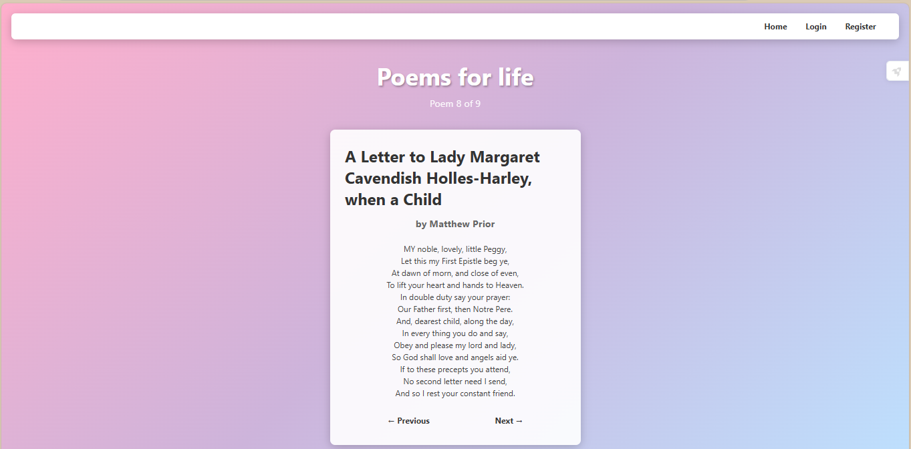

# 📚 Poems For Life - API Data Processor

> **A Flask-based web application that fetches random poems from PoetryDB API, processes them, and displays them in an elegant interface with user authentication.**

---

## 📋 Table of Contents

- [Project Overview](#-project-overview)
- [API Documentation](#-api-documentation)
- [Project Requirements Fulfillment](#-project-requirements-fulfillment)
- [Features](#-features)
- [Project Structure](#-project-structure)
- [Setup Instructions](#-setup-instructions)
- [How to Run](#-how-to-run)
- [Code Walkthrough](#-code-walkthrough)
- [Data Processing Examples](#-data-processing-examples)
- [Screenshots](#-screenshots)
- [Technologies Used](#-technologies-used)

---

## 🎯 Project Overview

**Poems For Life** is a full-stack web application that:

- Fetches random poems from the **PoetryDB API**
- Processes and filters poems based on line count
- Stores processed data in JSON format
- Provides a beautiful user interface to browse poems
- Includes user authentication (register/login/logout)
- Allows navigation through poem history (previous/next)

---

## 📖 API Documentation

**API Used:** [PoetryDB API](https://poetrydb.org/)

**Endpoint:** `https://poetrydb.org/random`

**Documentation Link:** https://github.com/thundercomb/poetrydb

**API Details:**

- **Type:** Public REST API
- **Authentication:** Not required
- **Response Format:** JSON
- **Rate Limit:** None
- **Data Returned:** Random poem with title, author, lines, and line count

---

## ✅ Project Requirements Fulfillment

### 1. ✔️ API Selection

- **API Used:** PoetryDB API
- **Documentation:** Included above
- **Public:** Yes, no API key required

### 2. ✔️ Data Fetching

```python
# GET request to fetch random poem
url = "https://poetrydb.org/random"
response = requests.get(url)
data = response.json()
```

- Performs GET request
- Receives JSON format
- Parses JSON correctly

### 3. ✔️ Data Processing (Multiple Operations)

**Processing Operations Implemented:**

1. **Filter by Condition** - Only poems with ≤20 lines are accepted:

```python
while True:
    response = requests.get(url)
    data = response.json()
    if int(data[0]["linecount"]) <= 20:
        break  # Keep fetching until we get a short poem
```

2. **Extract Specific Fields** - Extract only relevant fields:

```python
newPoem = {
    "id": max([poem["id"] for poem in poems["poems"]], default=-1) + 1,
    "title": data[0]["title"],      # Extract title
    "author": data[0]["author"],    # Extract author
    "lines": data[0]["lines"]       # Extract lines
}
```

3. **Transform Data** - Generate unique IDs for each poem:

```python
"id": max([poem["id"] for poem in poems["poems"]], default=-1) + 1
```

4. **Count Items** - Track total poems and current position:

```python
poemsLength = len(poems_data["poems"])  # Count total poems
```

### 4. ✔️ Output

- Saves to **JSON file** (`output.json`)
- Automatically generated by the program
- Structured and readable format

### 5. ✔️ Documentation

- Complete README.md
- API documentation link included
- Setup instructions provided
- Run instructions included
- No API key needed (but setup shown for reference)

---

## 🌟 Features

### Core API Features

- **Fetch Random Poems:** Get random poems from PoetryDB
- **Smart Filtering:** Only stores poems with ≤20 lines for better readability
- **Data Persistence:** Saves all poems to `output.json`
- **Data Processing:** Extracts, transforms, and structures poem data

### Web Application Features

- **Beautiful UI:** Gradient background and modern design
- **User Authentication:** Register, Login, Logout functionality
- **Previous Poem:** Navigate to previously viewed poems
- **Next Poem:** View next poem or fetch a new one
- **Position Tracking:** Shows "Poem X of Y"
- **Session Management:** Maintains user state

---

## 📁 Project Structure

```
poems-for-life/
│
├── main.py                 # Flask application & routes
├── data.py                 # API fetching & data processing
├── requirements.txt        # Python dependencies
├── README.md              # Project documentation
│
├── Database/
│   ├── output.json        # Processed poems storage
│   └── users.json         # User data storage
│
├── templates/
│   ├── index.html         # Home page (poem display)
│   ├── login.html         # Login page
│   ├── register.html      # Registration page
│   └── register-success.html  # Success message
│
└── static/
    ├── all.css           # Global styles
    ├── header.css        # Header navigation styles
    ├── index.css         # Home page styles
    ├── login.css         # Login page styles
    ├── register.css      # Register page styles
    └── hover.js          # Header hide/show on scroll
```

---

## 🛠️ Setup Instructions

### Prerequisites

- Python 3.7 or higher
- pip (Python package manager)

### Step 1: Install Required Libraries

Create a `requirements.txt` file with:

```
Flask==3.0.0
requests==2.31.0
```

Install dependencies:

```bash
pip install -r requirements.txt
```

Or install manually:

```bash
pip install Flask requests
```

### Step 2: Create Database Directory

```bash
mkdir Database
```

### Step 3: Initialize JSON Files

Create `Database/output.json`:

```json
{
  "poems": []
}
```

Create `Database/users.json`:

```json
{
  "users": []
}
```

---

## 🚀 How to Run

### Method 1: Run Directly

```bash
python main.py
```

### Method 2: Using Flask Command

```bash
export FLASK_APP=main.py
flask run
```

### Access the Application

Open your browser and navigate to:

```
http://127.0.0.1:5000/
```

### Expected Output

```
* Running on http://127.0.0.1:5000
* Debug mode: on
```

---

## 💻 Code Walkthrough

### 1. Data Fetching & Processing (`data.py`)

#### Function: `fetch_and_process()`

**Purpose:** Fetches a random poem from the API and processes it

```python
def fetch_and_process():
    url = "https://poetrydb.org/random"

    # Keep fetching until we get a poem with ≤20 lines
    while True:
        response = requests.get(url)
        data = response.json()

        if int(data[0]["linecount"]) <= 20:
            break

    # Load existing poems
    poems = load_previous()

    # Process the new poem
    newPoem = {
        "id": max([poem["id"] for poem in poems["poems"]], default=-1) + 1,
        "title": data[0]["title"],
        "author": data[0]["author"],
        "lines": data[0]["lines"]
    }

    # Add to collection and save
    poems["poems"].append(newPoem)
    save(poems)

    return poems
```

**Key Processing Steps:**

1. **API Request:** GET request to fetch random poem
2. **Data Filtering:** Check if `linecount <= 20`
3. **Field Extraction:** Extract `title`, `author`, `lines`
4. **ID Generation:** Create unique ID using `max() + 1`
5. **Data Storage:** Append to existing poems list
6. **Persistence:** Save to `output.json`

#### Function: `load_previous()`

```python
def load_previous():
    with open("Database/output.json", "r") as file:
        return json.load(file)
```

**Purpose:** Loads all previously saved poems from JSON file

#### Function: `save(data)`

```python
def save(data):
    with open("Database/output.json", "w") as file:
        json.dump(data, file, indent=4)
```

**Purpose:** Saves processed data to JSON with proper formatting

---

### 2. Web Application Routes (`main.py`)

#### Route: `/` (Home Page)

```python
@app.route("/")
def home():
    poems_data = get_all_poems()

    # Initialize session index if not exists
    if "current_index" not in session:
        session["current_index"] = len(poems_data["poems"]) - 1

    current_index = session["current_index"]

    return render_template(
        "index.html",
        poem=poems_data["poems"][current_index],
        poemsLength=len(poems_data["poems"]),
        currentIndex=current_index,
        username=session.get("username")
    )
```

**What it does:**

- Loads all poems from database
- Tracks current poem position using session
- Renders poem at current index
- Shows navigation controls

#### Route: `/next` (Next Poem)

```python
@app.route("/next")
def next_poem():
    poems_data = get_all_poems()
    current_index = session.get("current_index", 0)

    if current_index < len(poems_data["poems"]) - 1:
        # Go to next existing poem
        session["current_index"] = current_index + 1
    else:
        # Fetch new poem from API
        fetch_and_process()
        session["current_index"] = len(poems_data["poems"])

    return redirect(url_for("home"))
```

**Logic:**

- If next poem exists → Navigate to it
- If at end → Fetch new poem from API
- Update session index
- Redirect to home

#### Route: `/previous` (Previous Poem)

```python
@app.route("/previous")
def previous_poem():
    current_index = session.get("current_index", 0)

    if current_index > 0:
        session["current_index"] = current_index - 1

    return redirect(url_for("home"))
```

**Logic:**

- If previous poem exists → Navigate to it
- If at beginning → Button disabled in UI
- Update session index

---

### 3. User Authentication

#### Register Route

```python
@app.route("/register", methods=["GET", "POST"])
def register_user():
    if request.method == "POST":
        data = load_db()

        username = request.form["username"]
        email = request.form["email"]
        password = request.form["password"]

        # Check for duplicate email
        for user in data["users"]:
            if email == user["email"]:
                flash("Email already taken", "error")
                return redirect(url_for("register_user"))

        # Add new user
        data["users"].append({
            "id": len(data["users"]),
            "username": username,
            "email": email,
            "password": password
        })

        save_db(data)
        return redirect(url_for("login_user"))

    return render_template("register.html")
```

#### Login Route

```python
@app.route("/login", methods=["GET", "POST"])
def login_user():
    if request.method == "POST":
        data = load_db()
        email = request.form["email"]
        password = request.form["password"]

        # Verify credentials
        for user in data["users"]:
            if email == user["email"] and password == user["password"]:
                session["user_id"] = user["id"]
                session["username"] = user["username"]
                session["email"] = user["email"]

                flash(f"Welcome back, {user['username']}!", "success")
                return redirect(url_for("home"))

        return "User not found"

    return render_template("login.html")
```

---

## 📊 Data Processing Examples

### Example 1: API Response (Raw)

```json
[
  {
    "title": "Sonnet 94: They that have power to hurt, and will do none",
    "author": "William Shakespeare",
    "lines": [
      "They that have power to hurt, and will do none,",
      "That do not do the thing they most do show,",
      "Who, moving others, are themselves as stone,",
      "Unmoved, cold, and to temptation slow;"
    ],
    "linecount": "14"
  }
]
```

### Example 2: Processed Output

```json
{
  "poems": [
    {
      "id": 3,
      "title": "Sonnet 94: They that have power to hurt, and will do none",
      "author": "William Shakespeare",
      "lines": [
        "They that have power to hurt, and will do none,",
        "That do not do the thing they most do show,",
        "Who, moving others, are themselves as stone,",
        "Unmoved, cold, and to temptation slow;"
      ]
    }
  ]
}
```

**Processing Applied:**

1. ✅ **Filtered:** Only poems with linecount ≤ 20
2. ✅ **Extracted:** Removed unnecessary `linecount` field
3. ✅ **Added:** Unique `id` field for tracking
4. ✅ **Structured:** Organized in `poems` array

---

## 📸 Screenshots

### 1. Home Page - Poem Display

```

```

### 2. Login Page

```

```

### 3. Register Page

```

```

---

## 🔧 Technologies Used

### Backend

- **Python 3.x** - Programming language
- **Flask** - Web framework
- **Requests** - HTTP library for API calls
- **JSON** - Data storage format

### Frontend

- **HTML5** - Structure
- **CSS3** - Styling with gradients and animations
- **JavaScript** - Dynamic header behavior
- **Jinja2** - Template engine

### API

- **PoetryDB API** - Source of poem data

---

## 📝 Sample `output.json` Structure

```json
{
  "poems": [
    {
      "id": 0,
      "title": "John Keats",
      "author": "George Gordon, Lord Byron",
      "lines": [
        "WHO killed John Keats?",
        "  \"I,\" says the Quarterly,",
        "So savage and Tartarly;",
        "  \"'T was one of my feats.\""
      ]
    },
    {
      "id": 1,
      "title": "The ocean said to me once",
      "author": "Stephen Crane",
      "lines": [
        "The ocean said to me once,",
        "\"Look!",
        "Yonder on the shore",
        "Is a woman, weeping."
      ]
    }
  ]
}
```

---

## 🎓 Key Learning Outcomes

1. ✅ **API Integration:** Successfully integrated external API
2. ✅ **Data Processing:** Implemented filtering, extraction, and transformation
3. ✅ **File I/O:** Read/write JSON files effectively
4. ✅ **Web Development:** Built full-stack Flask application
5. ✅ **Session Management:** Maintained user state across requests
6. ✅ **Error Handling:** Implemented validation and filtering logic

---

## 🚀 Future Enhancements

- 🔐 Add password hashing for security
- 🔍 Search poems by author or title
- ❤️ Add favorite poems feature
- 📱 Make responsive for mobile devices
- 🎨 Add theme customization
- 📧 Email verification for registration

---

## 👨‍💻 Developer

**Project Name:** Poems For Life - API Data Processor  
**Course:** Sprint 2 - API Task  
**Date:** January 2026

---

## 📄 License

This project is for educational purposes as part of a course assignment.

---

## 🙏 Acknowledgments

- **PoetryDB API** for providing free access to poetry data
- **Flask** for the excellent web framework
- Course instructors for project guidance

---

**End of README** 📚
