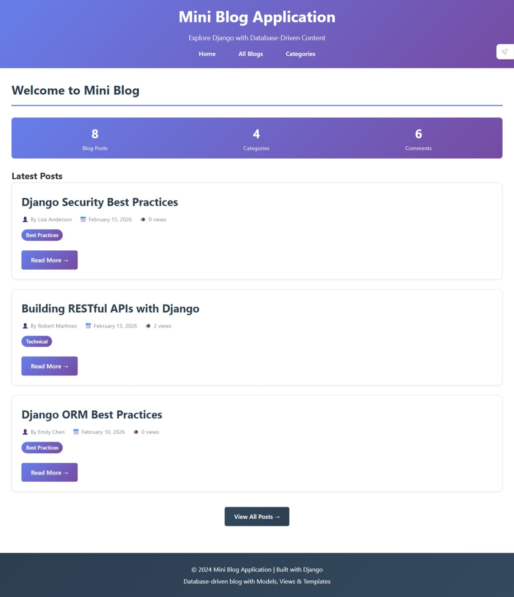
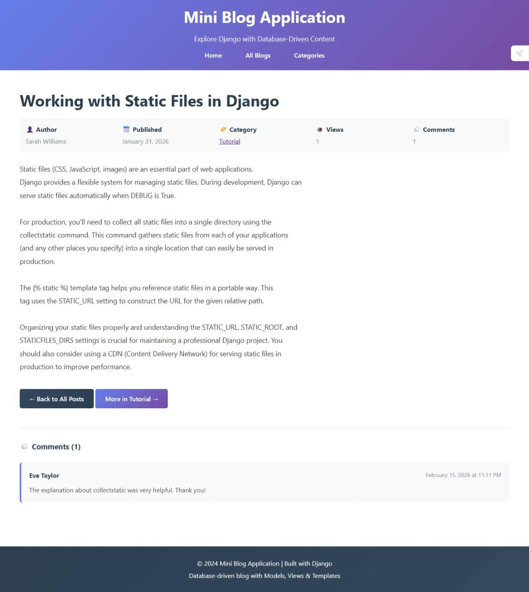

# 📝 Django Mini Blog Application

> A fully-functional blog application built with Django, demonstrating the MVT (Model-View-Template) architecture with database integration.

---

## 📋 Table of Contents

- [Overview](#overview)
- [Features](#features)
- [Technology Stack](#technology-stack)
- [Database Schema (ERD)](#database-schema-erd)
- [Project Structure](#project-structure)
- [Installation & Setup](#installation--setup)
- [Usage](#usage)
- [Key Concepts Demonstrated](#key-concepts-demonstrated)
- [Screenshots](#screenshots)
- [API Endpoints](#api-endpoints)
- [Future Enhancements](#future-enhancements)
- [Contributing](#contributing)
- [License](#license)

---

## 🎯 Overview

This is a **Mini Blog Application** built with Django 6.0 that showcases fundamental web development concepts including database design, CRUD operations, and the MVT architectural pattern. The application allows users to browse blog posts, filter by categories, view detailed posts with comments, and track view counts.

### Project Highlights

- **Full Database Integration** - SQLite database with proper relationships
- **3-Model Architecture** - Category, BlogPost, and Comment models
- **Function-Based Views** - Clear, maintainable view logic
- **Template Inheritance** - DRY principle with base templates
- **Django Admin Panel** - Full CRUD operations through admin interface
- **URL Namespacing** - Clean, organized routing
- **Static Files** - Custom CSS styling
- **Data Seeding** - Management command for loading sample data

---

## ✨ Features

### User Features

- **Home Page** - Display latest blog posts with statistics dashboard
- **Blog List** - View all published blog posts
- **Blog Detail** - Read full blog posts with metadata
- **Comments** - View approved comments on posts
- **Categories** - Browse posts by category
- **View Counter** - Track post popularity
- **Filter by Category** - See all posts in a specific category

---

## 🛠️ Technology Stack

| Technology                   | Purpose                               |
| ---------------------------- | ------------------------------------- |
| **Python 3.x**               | Backend programming language          |
| **Django 6.0**               | Web framework                         |
| **SQLite**                   | Database (development)                |
| **HTML5**                    | Template structure                    |
| **CSS3**                     | Styling with gradients and animations |
| **Django Template Language** | Dynamic content rendering             |

---

## 🗄️ Database Schema (ERD)

```
┌─────────────────────────────────────┐
│           Category                  │
├─────────────────────────────────────┤
│ PK  id (AutoField)                  │
│     name (CharField)                │
│     slug (SlugField, unique)        │
│     description (TextField)         │
│     created_at (DateTimeField)      │
└─────────────────────────────────────┘
                │
                │ One-to-Many
                │
                ▼
┌─────────────────────────────────────┐
│           BlogPost                  │
├─────────────────────────────────────┤
│ PK  id (AutoField)                  │
│     title (CharField)               │
│     slug (SlugField, unique)        │
│     author (CharField)              │
│     content (TextField)             │
│ FK  category_id                     │
│     published_date (DateField)      │
│     created_at (DateTimeField)      │
│     updated_at (DateTimeField)      │
│     is_published (BooleanField)     │
│     views_count (IntegerField)      │
└─────────────────────────────────────┘
                │
                │ One-to-Many
                │
                ▼
┌─────────────────────────────────────┐
│           Comment                   │
├─────────────────────────────────────┤
│ PK  id (AutoField)                  │
│     name (CharField)                │
│     email (EmailField)              │
│     content (TextField)             │
│ FK  post_id                         │
│     created_at (DateTimeField)      │
│     is_approved (BooleanField)      │
└─────────────────────────────────────┘
```

### Relationships Explained

- **Category → BlogPost**: One-to-Many (One category can have multiple posts)
- **BlogPost → Comment**: One-to-Many (One post can have multiple comments)
- **Foreign Keys**: Implement referential integrity with CASCADE delete

---

## 📁 Project Structure

```
mainSite/                          # Django project root
│
├── manage.py                      # Django management script
├── db.sqlite3                     # SQLite database
│
├── mainSite/                      # Project configuration
│   ├── __init__.py
│   ├── settings.py                # Project settings
│   ├── urls.py                    # Project-level URL routing
│   ├── wsgi.py                    # WSGI configuration
│   └── asgi.py                    # ASGI configuration
│
├── blogs/                         # Main blog application
│   ├── __init__.py
│   ├── admin.py                   # Admin interface configuration
│   ├── apps.py                    # App configuration
│   ├── models.py                  # Database models (Category, BlogPost, Comment)
│   ├── views.py                   # Function-based views
│   ├── urls.py                    # App-level URL routing
│   ├── tests.py                   # Unit tests
│   │
│   ├── management/                # Custom management commands
│   │   └── commands/
│   │       └── load_blog_data.py  # Data seeding command
│   │
│   ├── migrations/                # Database migrations
│   │   └── 0001_initial.py
│   │
│   └── templates/                 # HTML templates
│       └── blog/
│           ├── base.html          # Base template (parent)
│           ├── home.html          # Home page
│           ├── blog_list.html     # All blogs listing
│           ├── blog_detail.html   # Single blog view
│           ├── category_list.html # Categories overview
│           └── category_posts.html # Posts by category
│
└── static/                        # Static files
    └── css/
        └── style.css              # Custom CSS styling
```

---

## 🚀 Installation & Setup

### Prerequisites

- Python 3.8 or higher
- pip (Python package manager)
- Virtual environment (recommended)

### Step-by-Step Installation

#### 1. Clone or Download the Project

```bash
# If using git
git clone <repository-url>
cd mainSite

# Or download and extract the ZIP file
```

#### 2. Create Virtual Environment (Optional but Recommended)

```bash
# Windows
python -m venv venv
venv\Scripts\activate

# macOS/Linux
python3 -m venv venv
source venv/bin/activate
```

#### 3. Install Dependencies

```bash
pip install django
```

#### 4. Apply Database Migrations

```bash
python manage.py makemigrations
python manage.py migrate
```

#### 5. Create Superuser (Admin Account)

```bash
python manage.py createsuperuser
```

Follow the prompts to set:

- Username
- Email address
- Password

#### 6. Load Sample Data

```bash
python manage.py load_blog_data
```

This command will:

- Create 4 categories (Tutorial, Technical, Comparison, Best Practices)
- Generate 8 detailed blog posts
- Add 7 sample comments

#### 7. Run Development Server

```bash
python manage.py runserver
```

#### 8. Access the Application

Open your browser and visit:

- **Home Page**: http://127.0.0.1:8000/
- **Admin Panel**: http://127.0.0.1:8000/admin/

---

## 💻 Usage

### For End Users

#### Browse Blog Posts

1. Visit the home page to see the latest posts
2. View statistics (total posts, categories, comments)
3. Click "Read More" to view full blog posts

#### Explore Categories

1. Navigate to "Categories" from the menu
2. Click on any category to see related posts
3. Posts are organized by publication date

#### Read Blog Details

1. Click on any blog post title
2. View full content, author, date, and category
3. See view count and approved comments
4. Navigate to related posts in the same category

## 🧠 Key Concepts Demonstrated

### 1. MVT Architecture

```
┌──────────┐      ┌──────────┐      ┌──────────┐
│  Model   │ ←──→ │   View   │ ←──→ │ Template │
└──────────┘      └──────────┘      └──────────┘
     │                  │                  │
     │                  │                  │
  Database         Business            HTML/CSS
  (SQLite)          Logic             Presentation
```

- **Model**: Database structure and ORM (models.py)
- **View**: Request handling and logic (views.py)
- **Template**: HTML presentation (templates/)

### 2. Django ORM (Object-Relational Mapping)

#### Query Examples

```python
# Get all published posts
BlogPost.objects.filter(is_published=True)

# Get posts with related category (optimization)
BlogPost.objects.select_related('category')

# Get category with post count
Category.objects.annotate(post_count=Count('posts'))

# Get object or 404
get_object_or_404(BlogPost, slug=slug)
```

### 3. URL Routing

#### Project-level URLs (mainSite/urls.py)

```python
urlpatterns = [
    path('admin/', admin.site.urls),
    path('', include('blogs.urls')),  # Include app URLs
]
```

#### App-level URLs (blogs/urls.py)

```python
app_name = 'blog'  # Namespace

urlpatterns = [
    path('', views.home, name='home'),
    path('blogs/', views.blog_list, name='blog_list'),
    path('blogs/<slug:slug>/', views.blog_detail, name='blog_detail'),
]
```

#### Template Usage

```html
<a href="">Home</a>
<a href="">Read More</a>
```

### 4. Template Inheritance

#### Base Template (base.html)

```html
<!DOCTYPE html>
<html>
  <head>
    <title>Mini Blog</title>
  </head>
  <body>
     
  </body>
</html>
```

#### Child Template (home.html)

```html
 Home - Mini Blog

<h1>Welcome!</h1>

```

### 5. Foreign Key Relationships

```python
class BlogPost(models.Model):
    category = models.ForeignKey(
        Category,
        on_delete=models.CASCADE,  # Delete posts when category deleted
        related_name='posts'       # Access via category.posts.all()
    )

# Usage:
category = Category.objects.get(id=1)
posts = category.posts.all()  # Get all posts in this category
```

### 6. Custom Management Commands

```python
# blogs/management/commands/load_blog_data.py
from django.core.management.base import BaseCommand

class Command(BaseCommand):
    help = 'Load initial blog data'

    def handle(self, *args, **kwargs):
        # Create data
        BlogPost.objects.create(...)
        self.stdout.write('Data loaded successfully!')
```

Usage:

```bash
python manage.py load_blog_data
```

### 7. Slug Generation

```python
from django.utils.text import slugify

def save(self, *args, **kwargs):
    if not self.slug:
        self.slug = slugify(self.title)  # "My Post" → "my-post"
    super().save(*args, **kwargs)
```

---

## 📸 Screenshots

### Home Page



### Blog Detail Page



---

## 🌐 API Endpoints

| URL                 | View Function      | Name                  | Description                |
| ------------------- | ------------------ | --------------------- | -------------------------- |
| `/`                 | `home()`           | `blog:home`           | Homepage with latest posts |
| `/blogs/`           | `blog_list()`      | `blog:blog_list`      | All blog posts             |
| `/blogs/<slug>/`    | `blog_detail()`    | `blog:blog_detail`    | Single blog post           |
| `/categories/`      | `category_list()`  | `blog:category_list`  | All categories             |
| `/category/<slug>/` | `category_posts()` | `blog:category_posts` | Posts by category          |
| `/admin/`           | Django Admin       | -                     | Admin interface            |

### URL Patterns Explained

```python
# Slug-based routing
path('blogs/<slug:slug>/', views.blog_detail)

# Example URLs:
# /blogs/getting-started-with-django/
# /blogs/django-orm-best-practices/

# <slug:slug> captures the slug part and passes it to the view
def blog_detail(request, slug):
    post = get_object_or_404(BlogPost, slug=slug)
    ...
```

---

## 🔧 Configuration

### Key Settings (settings.py)

```python
# Database
DATABASES = {
    'default': {
        'ENGINE': 'django.db.backends.sqlite3',
        'NAME': BASE_DIR / 'db.sqlite3',
    }
}

# Static Files
STATIC_URL = '/static/'
STATICFILES_DIRS = [
    os.path.join(BASE_DIR, 'static'),
]

# Installed Apps
INSTALLED_APPS = [
    'django.contrib.admin',
    'django.contrib.auth',
    # ... other apps
    'blogs',  # Our custom app
]
```

---

## 🎨 Design Patterns Used

### 1. **DRY (Don't Repeat Yourself)**

- Template inheritance eliminates repeated HTML
- Base template contains common elements
- Child templates only define unique content

### 2. **Fat Models, Thin Views**

- Business logic in models (e.g., `increment_views()`)
- Views focus on request/response handling
- Models handle data operations

### 3. **Convention Over Configuration**

- Follow Django naming conventions
- Auto-generated slugs from titles
- Predictable URL patterns

### 4. **Separation of Concerns**

- Models: Data structure
- Views: Business logic
- Templates: Presentation
- URLs: Routing
- Static: Styling

---

## Database Statistics

### Sample Data Included

- **Categories**: 4
  - Tutorial (3 posts)
  - Technical (2 posts)
  - Comparison (1 post)
  - Best Practices (2 posts)

- **Blog Posts**: 8
  - All with unique slugs
  - Rich content (300-500 words each)
  - Published dates spanning 30 days
  - View counts tracked

- **Comments**: 7
  - 6 approved, 1 pending
  - Linked to specific posts
  - User names and emails

---

## 🚧 Future Enhancements

### Planned Features

- [ ] **Admin**
  - make an admin
    ........
- [ ] **User Authentication**
  - User registration and login
  - User profiles
  - Author-specific dashboards

- [ ] **Comment Form**
  - Frontend comment submission
  - Email notifications
  - CAPTCHA integration

- [ ] **Search Functionality**
  - Full-text search
  - Filter by date range
  - Tag-based filtering

- [ ] **Pagination**
  - Limit posts per page
  - Previous/Next navigation
  - Page numbers

- [ ] **Rich Text Editor**
  - WYSIWYG editor for content
  - Image uploads
  - Syntax highlighting for code

- [ ] **Social Features**
  - Share buttons (Twitter, Facebook)
  - Like/favorite posts
  - Bookmark posts

- [ ] **Analytics Dashboard**
  - View statistics
  - Popular posts
  - Traffic graphs

- [ ] **REST API**
  - Django REST Framework
  - JSON endpoints
  - API authentication

- [ ] **Testing**
  - Unit tests for models
  - Integration tests for views
  - Test coverage reports

- [ ] **Deployment**
  - PostgreSQL database
  - Gunicorn/uWSGI
  - Nginx configuration
  - AWS/Heroku deployment

---

## 📚 Learning Resources

### Django Documentation

- [Official Django Documentation](https://docs.djangoproject.com/)
- [Django Tutorial](https://docs.djangoproject.com/en/stable/intro/tutorial01/)
- [Django ORM Documentation](https://docs.djangoproject.com/en/stable/topics/db/)

## 📄 License

This project is created for educational purposes. Feel free to use it for learning and development.

---

## 👨‍💻 Author

## **Rawan Ahmed**

## 🙏 Acknowledgments

- Star Union BackEnd Committee
- Django Software Foundation for the amazing framework
- MDN Web Docs for HTML/CSS reference
- The open-source community

---

---

## 🎓 Educational Value

This project is perfect for:

- Learning Django fundamentals
- Understanding MVT architecture
- Practicing database design
- Exploring ORM queries
- Building portfolio projects
- Teaching web development concepts

---

## ⚡ Quick Start Commands

```bash
# Clone and setup
git clone <repo-url>
cd mainSite
python -m venv venv
source venv/bin/activate  # On Windows: venv\Scripts\activate
pip install django

# Initialize database
python manage.py migrate
python manage.py createsuperuser
python manage.py load_blog_data

# Run server
python manage.py runserver

# Open browser to http://127.0.0.1:8000/
```

---

## 📈 Project Statistics

- **Lines of Code**: ~1,500
- **Number of Models**: 3
- **Number of Views**: 5
- **Number of Templates**: 6
- **Number of URL Patterns**: 6
- **Database Tables**: 3 + Django defaults

---

<div align="center">

### Made with ❤️ and Django

</div>
