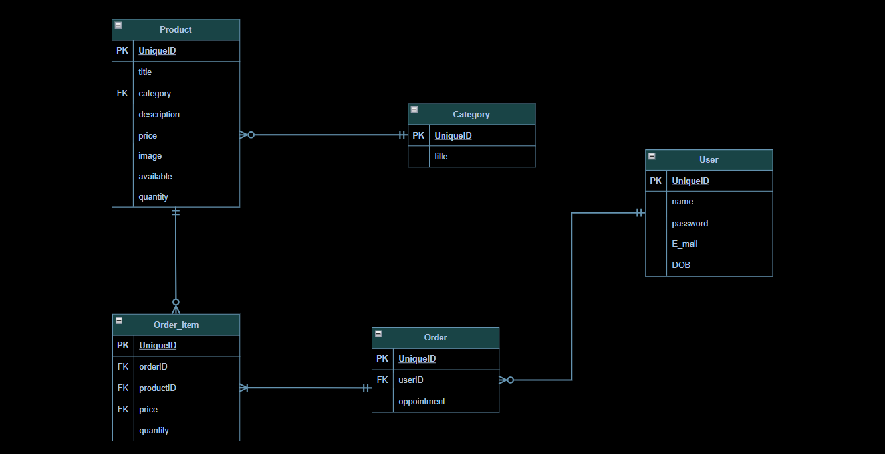

# 🛒 Mini Amazon App

A modern, simplified e-commerce web application built with **Django**. This project simulates the core functionalities of an online store, featuring a sleek **Dark Mode** user interface, dynamic shopping cart, and a complete checkout process.


## ✨ Features

* **User Authentication:** Secure Sign Up and Log In system.
* **Product Catalog:** Browse products with an intuitive grid layout.
* **Search & Filter:** Easily find products using the search bar or filter by category.
* **Dynamic Shopping Cart:** Add products to the cart, view quantities, and calculate real-time totals.
* **Checkout System:** Complete orders using "Cash on Delivery". 
* **Inventory Management:** Automatically deducts purchased quantities from the database.
* **Modern UI:** A clean, responsive, and elegant Dark Mode design.

## 🛠️ Tech Stack

* **Backend:** Python, Django
* **Frontend:** HTML5, Custom CSS (Modern Dark Theme)
* **Database:** SQLite (Default Django database)

## 🚀 How to Run the Project Locally

Follow these simple steps to get the project running on your local machine:

**1. Clone the repository (or download the files):**

```bash
git clone https://github.com/Backend-Committee/Mentorship-Phase-2026.git
cd mini-amazon-app
python -m venv .venv
# On Windows:
.venv\Scripts\activate
# On Mac/Linux:
source .venv/bin/activate
pip install django pillow
python manage.py migrate
python manage.py createsuperuser
python manage.py runserver
