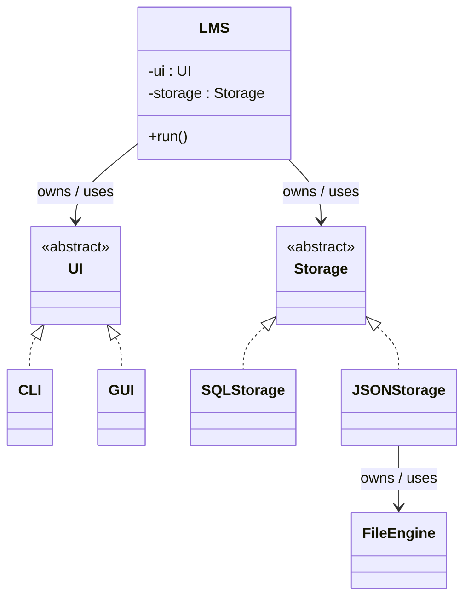

```mermaid
classDiagram
    direction TB

    %% UI Layer
    class UI {
        <<abstract>>
    }

    class CLI
    class GUI

    UI <|.. GUI
    UI <|.. CLI

    %% Core
    class LMS {
        -ui : UI
        -storage : Storage
        +run()
    }

    %% Storage Layer
    class Storage {
        <<abstract>>
    }

    class SQLStorage
    class JSONStorage
    class FileEngine

    Storage <|.. SQLStorage
    Storage <|.. JSONStorage

    JSONStorage --> FileEngine : owns / uses

    %% Relationships
    LMS --> UI : owns / uses
    LMS --> Storage : owns / uses
```